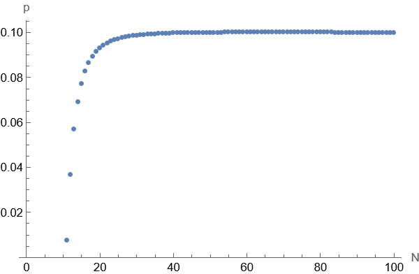

In today's lecture, the prof talked about basic statistics and programming for data analytics. But I don't think she was specific enough, and so I try to expand on several topics.


## 1. Poisson Distribution

reference: [Poisson Distribution — Intuition, Examples, and Derivation](https://towardsdatascience.com/poisson-distribution-intuition-and-derivation-1059aeab90d) 

### 1.1 problem introduction

Let's consider the problem: **Suppose that a call center representative receives an average of 10.56 calls per day, then what is the probability of them receiving 8 calls in a specific day.**

When modeling real world problems, we always have assumptions. We set two assumptions here:

1. the calls are independent: the occurrence of one call won't cause or prevent another call.
2. calls happen with the same probability across the working hours: you can divide the interval into any tiny slices of equal length, and calls are equal likely to happen in every slice.

The second assumption is a weird one: how could we guarantee the probability of receiving calls are equal across the day? Actually, it is not rigorously guaranteed. There is always a gap between the assumptions of Statistical models and the reality, and that's why we cannot just mathematically prove something, but need empirical data to support our claim. The role the assumptions play is to make math easier, but assumptions too far from reality can make models meaningless.


### 1.2 Use Binomial Distribution to model the problem

Table 1.

| Slices      | Slice 1 | Slice 2 | ...  | Slice N |
| ----------- | ------- | ------- | ---- | ------- |
| Probability | p       | p       | ...  | p       |

To apply Binomial Distribution into the problem, firstly we need to **divide the time interval into $N$ equal slices**, as shown in Table 1. We further assume that only one call can occur in a time slice, and this assumption can be removed later. Now we get the basic trial: whether there is a phone call in the $ith.$ slice, and this trial happens independently and **of the same probability**(from our assumption that calls happen with the same probability across the working hours). Let's set the probability $p$, and $X$ the random variable denoting the number of calls received in a day. So we get:
$$
X \sim \text{B}(N, p)
$$
We already know that the call center representative receives an average of 10.56 calls per day. Let's set $\lambda$ to be the average value, so in this case, $\lambda = 10.56$.

From the knowledge of Bernoulli distribution:
$$
E[X]=Np=\lambda
$$
So:
$$
p=\frac{\lambda}{N}
$$
We want to estimate the probability that the representative receives 8 calls per day. Let's set $k=8$. So we can compute the probability in the following way:
$$
P(k)=C(k, N)*p^k*(1-p)^{N-k} = \binom{N}{k}*(\frac{\lambda}{N})^k*(1-\frac{\lambda}{N})^{N-k}
$$
Which means 8 of the $N$ time slices have calls.

We know $k$(we want to estimate the probability of receiving $k$ phone calls), $\lambda$(average number of phone calls in a day), and $N$(we set it). 

We are don(e)... Wait a minute, the probability varies with the $N$? Let's plot it to see how it looks like:


$$
p=\binom{N}{8}*(\frac{10.56}{N})^8*(1-\frac{10.56}{N})^{N-8}
$$
Obviously, the probability converges to a value near 0.10.

### 1.3 Poisson Distribution comes in

If we let $N$ approach infinity, then we get Poisson Distribution. Fore-mentioned assumption of Binomial Distribution that one call can occur in a time can be eliminated now, as in an infinite small time slice, at most one call can happen. So, let's just compute the limit:
$$
\displaystyle{\lim_{N \to \infty}} \binom{N}{k}*(\frac{\lambda}{N})^k*(1-\frac{\lambda}{N})^{N-k}
$$
How to do it? Simple. Type this into [Mathematica](https://www.wolframalpha.com/):

```mathematica
Limit[Binomial[N, k]*(\[Lambda]/N)^k*(1 - \[Lambda]/N)^(N - k), 
 N -> Infinity, Assumptions -> {k > 0, \[Lambda] > 0}]
```

Then it's done:
$$
\frac{e^{-\lambda} \lambda^k}{\Gamma(1 + k)}
$$
Where $\Gamma(1 + k)$ equals $k!$

Here we compute it manually just to satisfy our curiosity:
$$
\displaystyle{\lim_{N \to \infty}} \binom{N}{k}*(\frac{\lambda}{N})^k*(1-\frac{\lambda}{N})^{N-k}=\displaystyle{\lim_{N \to \infty}} \frac{N!}{k!(N-k)!}*(\frac{\lambda}{N})^k*(1-\frac{\lambda}{N})^{N-k}=\displaystyle{\lim_{N \to \infty}} \frac{N!}{N^k(N-k)!}*\frac{\lambda^k}{k!}*(1-\frac{\lambda}{N})^{N-k})
$$
We have decomposed the limit into three parts, and let's solve the three parts:

1. 

$$
\displaystyle{\lim_{N \to \infty}} \frac{N!}{N^k(N-k)!}=\displaystyle{\lim_{N \to \infty}} \frac{N*(N-1)*...*(N-k+1)}{N^k}=1
$$

2. just keep it, as it is a constant number
3. 

$$
\displaystyle{\lim_{N \to \infty}} (1-\frac{\lambda}{N})^{N-k} = \displaystyle{\lim_{N \to \infty}} e^{(N-k)ln(1-\frac{\lambda}{N})}=\displaystyle{\lim_{N \to \infty}} e^{(N-k)*(-\frac{\lambda}{N})}=e^{-\lambda}
$$

Piece them together:
$$
\displaystyle{\lim_{N \to \infty}} \binom{N}{k}*(\frac{\lambda}{N})^k*(1-\frac{\lambda}{N})^{N-k}=\frac{\lambda^k}{k!}*e^{-\lambda}
$$
Okay, let's give an answer to our question:
$$
P(\lambda = 10.56, k = 8)=\frac{\lambda^k}{k!}*e^{-\lambda}=\frac{10.56^8}{8!}*e^{-10.56}=0.0994583
$$
It complies with our fore-mentioned 0.10 estimation.

### 1.4 Delve deeper

#### 1.4.1 Applications

[8 Poisson Distribution Examples in Real Life](https://studiousguy.com/poisson-distribution-examples/)

1. Number of Network Failures per Week
2. Number of Bankruptcies Filed per Month
3. Number of Website Visitors per Hour
4. Number of Arrivals at a Restaurant
5. Number of Calls per Hour at a Call Center
6. Number of Books Sold per Week
7. Average Number of Storms in a City
8. Number of Emergency Calls Received by a Hospital Every Minute

#### 1.4.2 Summary of Assumptions

From [wiki](https://en.wikipedia.org/wiki/Poisson_distribution):

The Poisson distribution is an appropriate model if the following assumptions are true:

- *k* is the number of times an event occurs in an interval and *k* can take values 0, 1, 2, ....(It must be a discrete problem)
- The occurrence of one event does not affect the probability that a second event will occur. That is, events occur independently.(This is the first assumption we made before)
- The average rate at which events occur is independent of any occurrences. For simplicity, this is usually assumed to be constant, but may in practice vary with time.(This is the second assumption we made before)
- Two events cannot occur at exactly the same instant; instead, at each very small sub-interval, either exactly one event occurs, or no event occurs.

#### 1.4.3 Is Poisson Distribution a distribution?

When all the possibilities are summed up, the result must equal 1, which is:
$$
\sum_{k=0}^{\infin} \frac{\lambda^k}{k!}*e^{-\lambda} =1
$$
Type this into [Mathematica](https://www.wolframalpha.com/):

```mathematica
Sum[(\[Lambda]^k/k!)*Exp[-\[Lambda]], {k, 0, \[Infinity]}]
```

And the result is 1.

To compute it manually, we have to recall the [Taylor Series](https://en.wikipedia.org/wiki/Taylor_series):
$$
e^x=1+x+\frac{x^2}{2!}+\frac{x^3}{3!}+...
$$
Then we replace $x$ with $\lambda$, so we can get:
$$
\sum_{k=0}^{\infin} \frac{\lambda^k}{k!}*e^{-\lambda} =e^{-\lambda} * \sum_{k=0}^{\infin} \frac{\lambda^k}{k!}=e^{-\lambda}* e^{\lambda}=1
$$

#### 1.4.4 Mean and Variance

Mean:
$$
E[X]=\sum_{k=0}^{\infin}P(k)*k=\sum_{k=0}^{\infin} \frac{\lambda^k}{k!}*e^{-\lambda}*k=e^{-\lambda}\sum_{k=1}^{\infin} \frac{\lambda^k}{(k-1)!}
$$

$$
=e^{-\lambda} *\lambda\sum_{k=1}^{\infin} \frac{\lambda^{k-1}}{(k-1)!}=e^{-\lambda} *\lambda *e^{\lambda} =\lambda
$$

Variance:
$$
V[X]=\sum_{k=0}^{\infin}P(k)*k^2=e^{-\lambda}\sum_{k=1}^{\infin} \frac{\lambda^k*k}{(k-1)!}
$$
