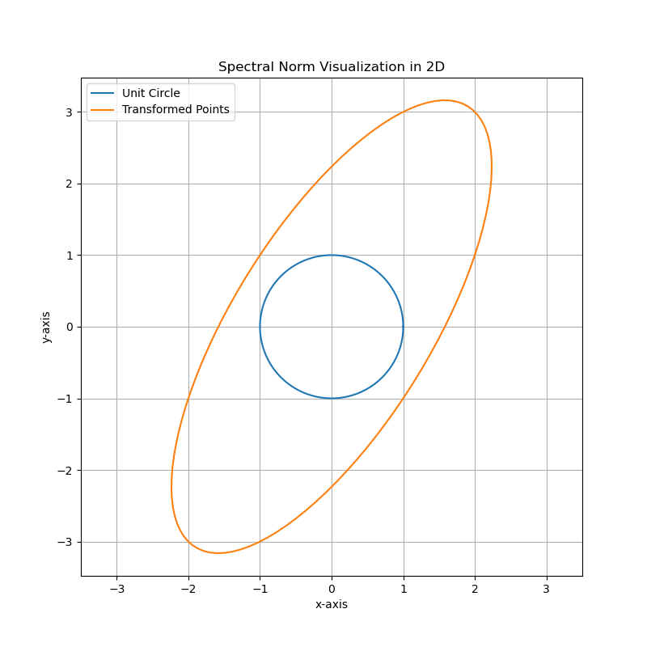

# Lecture 2

Today, the prof talked about norms, K-means and K-medians, and I would like to explain the proof of some theorems.

## 1. Matrix Norm

The prof used two ways to define Matrix Norms. The first is Frobenius norm, and the second is defined with this formula:
$$
\lVert A \rVert_{p}=\underset{x \in R^n,x\neq 0}{sup} \frac{\lVert Ax \rVert_{p}}{\lVert x \rVert_{p}}
$$
Firstly, we can easily prove that this definition satisfies the conditions for norm. Noteworthily, it is required that $\lVert A \rVert_{p}$ is zero only when $x$ is zero, and as $x$ cannot be zero, $\lVert A \rVert_{p}$ can never be zero.

Then, we can use another way to represent this norm:
$$
\lVert A \rVert_{p}=\underset{x \in R^n,x\neq 0}{sup} \lVert A*\frac{x}{{\lVert x \rVert_{p}}} \rVert_{p}=\underset{\lVert x \rVert_{p}=1}{sup} \lVert Ax \rVert_{p}
$$
When $p=2$, the norm is called **spectral norm**. A matrix can be thought as a transformation that acts on vectors, and the spectral norm represents the maximum stretching factor of a matrix.

Let's visualize it:

```python
A = np.array([[2, 1], [1, 3]])
```



The long axis reflects the spectral norm.

We shall start with the **spectral theorem**, which is a very advanced and complex theorem, so we won't want to prove it here, but just to present the conclusions that are relevant to what we are going to show:

1. For a real symmetric matrix whose dimension is $n*n$, it has $n$ orthonormal eigenvectors.
2. The number of eigenvalues of the symmetric matrix can be less than $n$, but for an eigenvalue $\lambda$ with a multiplicity $m$, it must have $m$ different eigenvectors.

Then, let's go on to prove the **Min-max theorem**(actually a corollary of it):

Let $A$ be a real symmetric matrix with eigenvalues  $\lambda_1 \leq \lambda_2 \leq .. \lambda_n$, we have:
$$
max\{R_A(x):x\neq0\}=\lambda_n
$$

$$
min\{R_A(x):x\neq0\}=\lambda_1
$$

where $R_A(x)$ is Rayleigh quotient given by the following formula:
$$
R_A(x) = \frac{x^T A x}{x^T x}
$$
Proof see [wiki](https://en.wikipedia.org/wiki/Min-max_theorem)

Finally, let's prove that **the spectral norm is equal to the maximum singular value of $A^TA$**
$$
\lVert Ax \rVert_{2}^2=\lVert x^TA^TAx \rVert_{2}
$$
Note that $A^TA$ is a real symmetric matrix, so we can induce from Min-max theorem:
$$
\lVert Ax \rVert_{2}^2=\lambda_n
$$
Where $\lambda_n$ is the largest eigenvalue of $A^TA$. Note that the denominator the Rayleigh quotient is  $x^T x=1$.

Therefore, we get the spectral norm by taking the square root of the max eigenvalue, and get the max singular value of $A^TA$.

Let's go back to our visualization to explain it. The radius of the major axis, which is the farthest distance from the origin to the eclipse, can be thought as $\underset{x}{max}\lVert Ax \rVert_{2},$ given $x^T x=1$. Note that every point on the eclipse is originally a point on the circle $x^T x=1$, and passes through the linear transform: $y=Ax$.